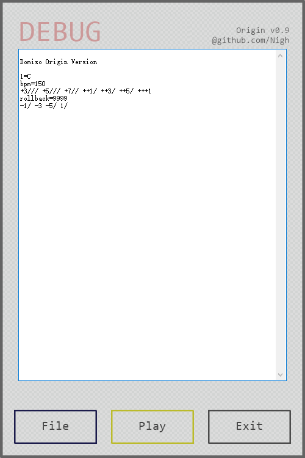

DoMiSo Documentation
==================

### [English](README.md)
### [简体中文](README_zh.md)

> This document has been mostly translated by `deepl.com/translator` and has been lightly proofread by hand.

## Screenshot

Instructions for use
------------------
- Paste a valid score in the input box
- Click on `Play` to listen to the score in midi

Current Version
------------------
v0.9 Origin

ahk version-`1.1.33.7 Unicode 32bit`

Update Log
------------------

- 2021.09.15 v0.9 Origin

  Separate the original version from the `Genshin` special edition and recreate the `repo` completely separate from the `Genshin` version

- 2021.4.6 v0.32A Genshin

  Fixes an issue where the time value of a bracketed chord was incorrectly affected by the time value of the previous bracketed chord

- 2021.4.1 v0.31A Genshin

  Fixing an abnormal shortcut key function

- 2021.3.29 v0.3A Genshin

  Add F9 as a start shortcut  
  Change the colour of the title to distinguish it from the manual version

- 2021.3.29 v0.2a Genshin

  Rewrote the UI and changed the GDIP implementation  
  Genshin Impact Special Edition with Auto-Play function

- 2013.7.6 v0.1a Alpha 

  Add a stop button  
  Add the ability to click on the tray icon to activate the main form  
  Added a window top button  
  Slightly changed the interaction of the title bar

- 2013.6.29 v0.1 Alpha

  First demo publish

Introduction
------------------
DoMiSo is a lightweight numbered musical notation interpreter that can convert formatted numbered musical notation into midi music and play it back.
There are several example scores in the same directory as this document. You can copy them to DoMiSo and play them back.

The `Carrying you.txt` in the `example_sheets` directory is a sample numbered musical notation with comments.

Grammar
------------------
DoMiSo's numbered musical notation format includes `control commands` and `note markers`.
The control commands include `key control`, `tempo control` and `rollback control`.

### Control commands ###

##### key control：

`1=F#`

When no scale number is added, the default is the 5th scale. I.e. the above command is equivalent to

`1=F5#`

Default `1=C` when no tonality is specified

##### tempo control：

`bpm=120`

Valid bpm ranges from `1` to `480`, values outside this range are considered invalid and will reset bpm to the initial value of `80`.

When no tempo is specified, the default is `bpm=80`.

##### rollback control：

`rollback=12.5`

The function of the Rollback command is to move the writing position of a note forward by `N` full note lengths at the current tempo. `N` can be a decimal number.

When there are multiple parts, this command can be used to write multiple parts separately. Its use will be described later.

All control commands are case-insensitive and can be placed on the same line as the note. The command will be executed before the note is parsed, regardless of its position on the line.

### note marker ###

##### Examples： #####

`++3b//` `-1#-/-` `5..` `( 1 3 5 )`

Each note is separated by a space and notes that do not meet the format are simply ignored.

##### Pitch： #####

The notes are marked from `0 to 7`, with the same meaning as in numbered musical notation.

The notes preceded by `+` and `-` indicate that the note is raised or lowered by N steps, N being the number of `+` or `-`.

The `#` and `b` after the note indicate that the note is raised or lowered by half tone.

##### Length： #####

The length-related markers are `/` `-` `. `

`/` means that the length of the preceding mark is reduced by half. The meaning is the same as the underscore in numbered musical notation.

`-` indicates the length of a whole note. The meaning is the same as in numbered musical notation. Can be used in combination with `/`.

`.` extends the length of the preceding note by half.

For example, `5..` has a note length of `1+0.5+0.25` beats.

`++3b//` has a note length of `0.25` beats.

`-1#-/-` has a note length of `1+0.5+1` beats.

`( 1 3- 5 )` has a note length of `2` beats. This is a chord. The use of the chord is described below.

##### Chord： #####
Notes enclosed in brackets will be treated as chords. In this case, the brackets need to be separated from the notes by a space. Otherwise they will be ignored as invalid notes.

Each note in the chord will be played at the same time and the length of the whole chord is determined by the longest note in the chord.

RollBack Example
------------------
This is a RollBack usage example to demonstrate the basic usage of the RollBack command.

This is written using the chord:

    ( 1 -1 ) ( 2 -2 ) ( 3 -3 ) ( 4 -4 ) ( 5 -5 ) ( 6 -6 ) ( 7 -7 )

This is written using rollback command：

    1 2 3 4 5 6 7
    rollback=7
    -1 -2 -3 -4 -5 -6 -7

The effect is the same for both ways of writing. More usage can be found in the sample sketches in the `example_sheets` directory.

Rollback command animation demonstration：

Donate
------------------
- Ko-fi: https://ko-fi.com/xianii
- Paypal: https://paypal.me/xianii
